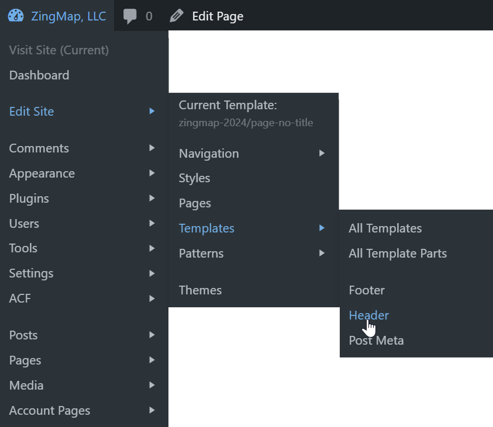

# RS Admin Bar (WordPress Plugin)

This plugin customizes many of the default admin bar nodes and reorganizes them beneath the site name dropdown menu. It includes menu items from the dashboard for easy access to common pages on the backend.

To correctly populate the settings menus, an administrator simply needs to visit the dashboard once a month. This is not strictly required, but dashboard menu items won't be listed until this happens.

## How it works

Here's what the default admin bar looks like:

Here's what the admin bar looks like with this plugin:

It's much simpler at first glance. The real benefit is in the dropdown menu. As you can see, there are convenient links to many of the block editor pages, as well as standard dashboard menu pages, and finally a list of post types.

## Complete list of links:
This includes items from WooCommerce and Gravity Forms. Those items only appear if you have the plugins installed.

Hyphens represent separators (technically, it's the end of a group).

* Visit Site
* Visit Store _[if WooCommerce is installed]_
* Dashboard
* --
* Edit Site
  * Current Template: [template name]
  * --
  * Navigation
    * All Navigation Menus
    * [menus from your theme appear here]
  * Styles
  * Pages
  * Templates
    * All Templates
    * All Template Parts
    * [template parts from your theme appear here]
  * Patterns
    * All Patterns
    * [patterns from your theme appear here]
* --
* Comments 
* Appearance
* Plugins
* Users
* Tools
* Settings
* --
* Posts
* Pages
* Media
* Products

## Changelog

### 1.2.0
* Updated to use menus from the dashboard, even when on the front-end
* Optimized query for edit site submenus
* Added indicator if you are on the front end, backend, or any woocommerce page
* Added submenus for Edit Site items: Navigation, Templates, Patterns
* Improved link to edit site if using block editor
* Fixed duplicate link to Plugins on frontend

### 1.1.1
* Added GitHub Updater support

### 1.1.0
* Initial release